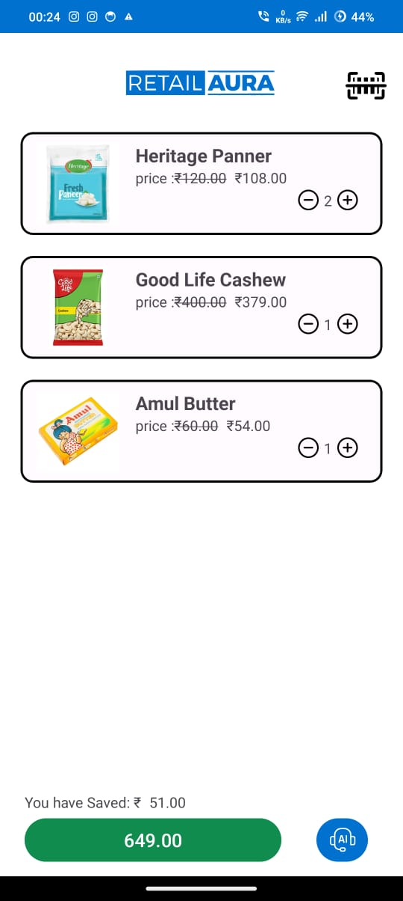

# RetailAura

RetailAura is an Android application designed to enhance customer shopping experiences by integrating advanced features such as barcode scanning, product recommendations, and an AI-powered chat assistant. The app is built using Kotlin, Firebase Firestore, and various other Android libraries and tools.

## Features

- **Barcode Scanning**: Easily scan product barcodes to fetch product details from Firestore.

- **Product Recommendations**: Get personalized product suggestions based on the items in your cart.

- **Chat Assistant**: Interact with a friendly AI chat assistant to get help with your shopping queries.

- **Payment Integration**: Seamless payment processing using Razorpay.

- **QR Code Generation**: Generate and display QR codes for transaction details.

- **Generative AI Model**: Suggest related products and enhance chat interactions using the Gemini API.


## Screenshots

#### Splash Screen


#### Sign In Activity


#### Main Activity


#### Product List


#### Chat Activity


#### Payment Activity


#### QR Code Activity


## Installation

1. Clone the repository:
   ```sh
   git clone https://github.com/rakeshreddyadina/RetailAura.git
   ```
2. Open the project in Android Studio.

3. Sync the project with Gradle files.

## Firebase Setup
1. Go to the Firebase Console: [Firebase Console](https://console.firebase.google.com/).

2. Create a new Firebase project (or use an existing one).

3. Add an Android app to your Firebase project. Use your app's package name when prompted.

4. Download the `google-services.json` file provided by Firebase.

5. Replace the existing `google-services.json` file in the `app/` directory of your project with the one you just downloaded.

## Dependencies
- Firebase Firestore

- Razorpay

- ML Kit Barcode Scanning

- Glide
 
- QRGen (for QR code generation)

- Gemini API

## Project Structure
```plaintext
retailaura/
├── app/
│   ├── src/
│   │   ├── main/
│   │   │   ├── java/com/adina/retailaura/
│   │   │   │   ├── chat/
│   │   │   │   │   ├── ChatActivity.kt
│   │   │   │   │   ├── ChatAdapter.kt
│   │   │   │   ├── core/
│   │   │   │   │   ├── MainActivity.kt
│   │   │   │   │   ├── SplashScreen.kt
│   │   │   │   ├── Models/
│   │   │   │   │   ├── ChatMessage.kt
│   │   │   │   │   ├── Product.kt
│   │   │   │   │   ├── Store.kt
│   │   │   │   ├── scan_pay/
│   │   │   │   │   ├── PaymentActivity.kt
│   │   │   │   │   ├── QRCodeActivity.kt
│   │   │   │   │   ├── ScanActivity.kt
│   │   │   │   │   ├── productAdapter.kt
│   │   │   ├── res/
│   │   │   │   ├── layout/
│   │   │   │   ├── drawable/
│   │   │   │   ├── values/
│   ├── build.gradle
├── build.gradle
```
## Detailed Description
### MainActivity
The MainActivity serves as the main entry point for the user after the splash screen. It integrates the following functionalities:
- Scanning barcodes using the device camera.

- Fetching product details from Firebase Firestore.

- Displaying the list of scanned products.

- Navigating to the ChatActivity and PaymentActivity.

### ChatActivity
The ChatActivity provides an interactive chat interface for users to communicate with the AI assistant. The key components include:

- ChatAdapter: Manages the display of chat messages in a RecyclerView.

- AI model integration using the generative model to provide responses based on user queries and cart contents.

### ScanActivity
The ScanActivity handles barcode scanning using the ML Kit Barcode Scanning API. It processes the scanned barcode and returns the result to the MainActivity.
 When an  `EAN-13` barcode is scanned, the data is fetched from Firebase by passing the barcode.

### PaymentActivity
The PaymentActivity integrates Razorpay for payment processing. It initiates a payment process and handles the success or failure callbacks.

### QRCodeActivity
The QRCodeActivity generates a QR code based on the transaction details and displays the amount paid and the amount saved.

### Models
- *ChatMessage*: Represents a chat message with a sender and message content.

- *Product*: Represents a product with details such as ID, name, price, discount price, quantity, and image URL.

- *Store*: Represents a store with details such as name, latitude, longitude, and location.

## Generative AI Model Integration
The app uses the Gemini API for its generative AI capabilities, enabling advanced product recommendations and chat interactions. The key features include:

*Product Recommendations*: Suggest related products based on the user's current cart and browsing history.

*Enhanced Chat Interactions*: Provide more accurate and contextually relevant responses in the chat assistant.

### Setting Up Gemini API
Sign up for the Gemini API and get your API key.
Add the API key to your project by including it in your local.properties file:
```properties
gemini.api.key=your_api_key_here
```
Use the API key in your application wherever the Gemini API is integrated.


## Contributing
Contributions are welcome! Please fork the repository and submit a pull request for any improvements or bug fixes.
